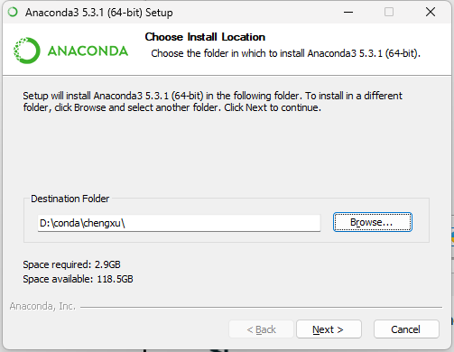
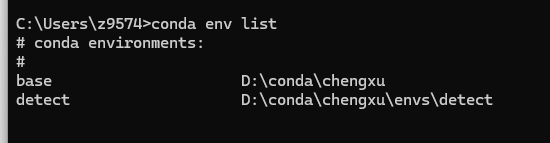
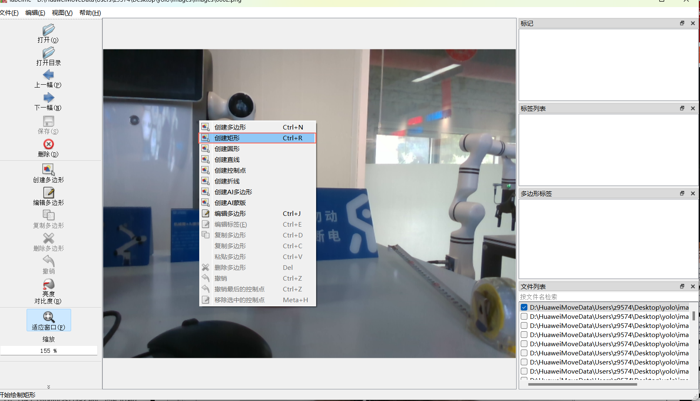

## 检测模型训练教程

本教程适用于**目标数量少、背景简单**的任务

适用于**未接触过模型训练**的新手

本教程引导您通过**分阶段**训练YOLO检测模型，实现一个目标检测模型的生成。流程包括：初步收集大量照片，选取少部分训练初步YOLOv8检测模型；使用该模型预测剩余图片，并人工微调标注数据；最后，以所有标注数据重训出一个更加精准的新模型。

### 一、python环境安装

Anaconda在环境隔离、包管理方面功能强大，这里安装Anaconda来构造python环境。

Anaconda安装包版本为Anaconda3-2024.10-1-Windows-x86_64.exe

conda安装包和labelme标注软件通过[链接](https://pan.baidu.com/s/1PIVQjrZOQJWhZMLZMvvwxQ?pwd=j5dg#list/path=%2F)下载





简单说明一下两个选项：

- Add Anaconda3 to my PATH environment variable：官方不建议将 Anaconda 添加到 PATH 环境变量中，怕会干扰其他软件，而是通过从开始菜单打开 Anaconda Navigator 或 Anaconda Prompt 来使用 Anaconda（其实是否勾选都没关系，PATH 可以自己后期更改），**这里加上**，可以在cmd里启动conda命令

- Register Anaconda3 as my default Python 3.12：除非计划安装和运行多个版本的 Anaconda 或者多个版本的 Python，否则勾选此复选框。


打开cmd，输入 

> conda --version


**anaconda安装成功**

### 二、软件包安装

#### 2.1 创建python虚拟环境

打开cmd命令行解释器，输入命令：

> conda create -n detect python=3.9

这里我们创建了版本的名为detect的python3.9的虚拟环境


创建过程中遇到([y]/n)?  输入y继续安装

安装完成之后，在cmd里输入:

> conda env list

会显示我们刚才创建的虚拟环境detect



说明我们虚拟环境创建成功

#### 2.2安装环境所需包

先输入命令激活我们之前创建的虚拟环境detect：

> conda activate detect


激活环境后安装所需要的包 ：

> pip install pyrealsense2==2.55.1.6486
>
> pip install opencv-python==4.10.0.84
> pip install numpy==2.0.2
>
> pip install PyYAML==6.0.2
>
> p install ultralytics==8.3.38
>
> pip install tqdm==4.67.1
>
> pip install pillow==11.0.0
>
> pip install scikit-learn==1.5.2 -i https://pypi.mirrors.ustc.edu.cn/simple/


或者通过下面方法安装

>pip install -r requirements.txt

### 三、数据采集

#### 3.1采集代码

data_collect.py

```python
"""
采集图片数据用来训练yolov8
"""

import pyrealsense2 as rs
import cv2
import os
import time
import numpy as np

# 创建保存图像的文件夹
color_output_folder = 'images\images'
os.makedirs(color_output_folder, exist_ok=True)

# 相机配置
pipeline = rs.pipeline()
config = rs.config()
config.enable_stream(rs.stream.depth, 640, 480, rs.format.z16, 30)
config.enable_stream(rs.stream.color, 640, 480, rs.format.bgr8, 30)
profile = pipeline.start(config)

# 创建对齐对象
align_to = rs.stream.color
align = rs.align(align_to)

print('<<<<<<<<<<<<<<<<<<<<<<<<<<<<<   Start Detectionqq >>>>>>>>>>>>>>>>>>>>>>>>>>>>')

start_time = time.time()
frame_count = 0

while True:

    frames = pipeline.wait_for_frames()
    aligned_frames = align.process(frames)
    aligned_depth_frame = aligned_frames.get_depth_frame()
    color_frame = aligned_frames.get_color_frame()
    depth_image = np.asanyarray(aligned_depth_frame.get_data())
    color_image = np.asanyarray(color_frame.get_data())

    # 生成文件名
    frame_number = frame_count + 1
    filename = f'{frame_number:04d}.png'
    color_file_path = os.path.join(color_output_folder, filename)

    cv2.imshow('Color Image', color_image)
    c = cv2.waitKey(1)


    # 保存颜色图像和深度图像
    if c == ord('s'):

        cv2.imwrite(color_file_path, color_image)
        frame_count += 1
        print(f'frame_count:{frame_count}')


    # 按下 'q' 键退出循环
    if cv2.waitKey(1) == ord('q'):
        break

# 关闭窗口并停止相机
cv2.destroyAllWindows()
pipeline.stop()

print(f'Total frames captured: {frame_count}')

```

#### 3.2 采集注意事项

采集图像需要注意以下几方面：

- 采集图片数量

  确保**每个类别**有500+张图片，如果类别特别复杂或目标变化较大，建议增加至 1000 张或更多。

- 采集场景

   针对模型实际使用的场景

  - 在不同的场景、背景和环境下采集数据
  - 从不同的角度和距离采集目标对象的图像
  - 在不同的光照条件下采集数据

  

#### 3.3 采集步骤

在python环境中运行采集图像脚本程序data_collect.py，将相机对准物体后，点击键盘上的"s"键盘采集当前图片，共采集一定数量的图片。

图片采集完毕后，点击键盘上的"q"键结束采集。


### 四、labelme标注图像

点击Labelme.exe软件打开界面，点击打开目录选择之前保存采集图片的文件夹：


在标注第一幅图片的时候，右键图片-选择矩形：


用矩形框住物体后点击鼠标左键自定义物体标签：


点击下一幅图片进行标注：


标注一张图片之后，会在图片同路径下生成**同名的json文件**，在所有采集的图片中，每个类别选择100-300张图片进行标注（确保覆盖所有类别）。

json里面是标注对象的坐标、标签等详细信息。

json文件格式如下：

```json
{
  "version": "5.5.0",
  "flags": {},
  "shapes": [
    {
      "label": "bottle",
      "points": [
        [
          224.51612903225805,
          142.25806451612902
        ],
        [
          316.1290322580645,
          399.0322580645161
        ]
      ],
      "group_id": null,
      "description": "",
      "shape_type": "rectangle",
      "flags": {},
      "mask": null
    }
  ],
  "imagePath": "0002.png",
  "imageData": "iVBORw0KGgoAAAANSUhEUgAAAoAAAAHgCAIAAAC6s0uzAAEAAElEQVR4nLT9S7MtSZYehn3f8oh9zn1kVlZmvbIeXZ1dEIAWSQEDkpIoETCOZISZZjCTmQb6E/wtmmoiDWgmmUw0mWEoARLABggDCHQ3WO",
  "imageHeight": 480,
  "imageWidth": 640
}
```

- shapes: 其中包含了标注的具体信息，由列表组成，每一个元素是一个字典，一个字典包含了一个标注框的相关信息，如label是自定义的标签，points是标注的点，points的取值与shape_type相关，这里取的是rectangle即直接由矩形的对角线上两点确定一个矩形框。因此points中也只有两个点的信息（检测框左上角和右下角的点坐标），点的坐标为(x,y) ，坐标轴原点在图像左上角，原点向下为y正向，向右为x正向。

- imagePath是标注图片的文件名
- shape_type记录了标注时选择的方式。
  

我们**先用标注的图片**训练一个模型，用模型对剩余的**未标注的图片**进行**自动标注**，然后用所有的图片和标注训练一个最终的模型，为什么这么做，因为当前采集图片里物体只有一个物体，**手动标注工作量不大**，以后可能遇到一张采集图片里有多个待标注物的情况，这种情况下全部手动标注图片工作量大，效率低。

以后可能遇到待标注的是**这种情况**：


### 五、检测模型训练（初步训练）

#### 5.1 剪切文件

将**上一步标注的图片**以及标注文件**剪切出来**放到一个新的文件夹images2中，上面标注生成的文件都是json文件，文件的格式见上一步说明


#### 5.2 转化格式


YOLO模型使用的是基于TXT文件的标注格式，每个TXT文件包含了与图片中目标相对应的信息，包括目标类别和在图片中的位置。YOLO标注文件的格式如下：

```
<class> <x_center> <y_center> <width> <height>
```

其中：

- `<class>` 表示目标类别的索引（从0开始）。
- `<x_center>`, `<y_center>` 分别表示目标框的中心点相对于图片左上角（坐标原点）的横纵坐标比例值，取值范围为0,10,1。例如，如果图片宽度为640像素，高度为480像素，那么一个中心点在水平方向上占据了图片宽度的1/4，在垂直方向上占据了图片高度的1/3，则 `<x_center>` 为0.25, `<y_center>` 为0.33。
- `<width>`, `<height>` 分别表示目标框宽度和高度相对于整个图片宽度和高度的比例值，同样取值范围为0,10,1。例如，如果目标框宽度占据了图片宽度的1/2，高度占据了图片高度的1/4，则 `<width>` 为0.5, `<height>` 为0.25。


我们将上面的labelme生成的标注文件（json格式）转化成yolo需要的标注文件（保存在txt文件中）以及按照训练要求划分**训练集、验证集以及测试集**。

我们使用下面的脚本实现labelme标注文件（json格式）到 yolo标准文件（txt格式）以及转化和划分数据集的功能：

final.py

```python
# -*- coding: utf-8 -*-

import os
import numpy as np
import json
from glob import glob
import cv2
import shutil
import yaml
from sklearn.model_selection import train_test_split
from tqdm import tqdm
from PIL import Image


'''
统一图像格式
'''
def change_image_format(label_path, suffix='.png'):
    """
    统一当前文件夹下所有图像的格式，如'.jpg'
    :param suffix: 图像文件后缀
    :param label_path:当前文件路径
    :return:
    """
    externs = ['png', 'jpg', 'JPEG', 'BMP', 'bmp']
    files = list()
    # 获取尾缀在ecterns中的所有图像
    for extern in externs:
        files.extend(glob(label_path + "\\*." + extern))
    # 遍历所有图像，转换图像格式
    for index,file in enumerate(tqdm(files)):
        name = ''.join(file.split('.')[:-1])
        file_suffix = file.split('.')[-1]
        if file_suffix != suffix.split('.')[-1]:
            # 重命名为jpg
            new_name = name + suffix
            # 读取图像
            image = Image.open(file)
            image = cv2.cvtColor(np.asarray(image), cv2.COLOR_RGB2BGR)
            # 重新存图为jpg格式
            cv2.imwrite(new_name, image)
            # 删除旧图像
            os.remove(file)


'''
读取所有json文件，获取所有的类别
'''
def get_all_class(file_list, label_path):
    """
    从json文件中获取当前数据的所有类别
    :param file_list:当前路径下的所有文件名
    :param label_path:当前文件路径
    :return:
    """
    # 初始化类别列表
    classes = list()
    # 遍历所有json,读取shape中的label值内容，添加到classes
    for filename in tqdm(file_list):
        json_path = os.path.join(label_path, filename + '.json')
        json_file = json.load(open(json_path, "r", encoding="utf-8"))
        for item in json_file["shapes"]:
            label_class = item['label']
            if label_class not in classes:
                classes.append(label_class)
    print('read file done')
    return classes


'''
划分训练集、验证机、测试集
'''
def split_dataset(label_path, test_size=0.3, isUseTest=False, useNumpyShuffle=False):
    """
    将文件分为训练集，测试集和验证集
    :param useNumpyShuffle: 使用numpy方法分割数据集
    :param test_size: 分割测试集或验证集的比例
    :param isUseTest: 是否使用测试集，默认为False
    :param label_path:当前文件路径
    :return:
    """
    # 获取所有json
    files = glob(label_path + "\\*.json")
    #获取所有json文件的名字
    files = [i.replace("\\", "/").split("/")[-1].split(".json")[0] for i in files]

    if useNumpyShuffle:
        file_length = len(files)
        index = np.arange(file_length)
        np.random.seed(32)
        np.random.shuffle(index) # 随机划分

        test_files = None
        # 是否有测试集
        if isUseTest:
            trainval_files, test_files = np.array(files)[index[:int(file_length * (1 - test_size))]], np.array(files)[
                index[int(file_length * (1 - test_size)):]]
        else:
            trainval_files = files
        # 划分训练集和测试集
        train_files, val_files = np.array(trainval_files)[index[:int(len(trainval_files) * (1 - test_size))]], \
                                 np.array(trainval_files)[index[int(len(trainval_files) * (1 - test_size)):]]
    else:
        test_files = None
        if isUseTest:
            trainval_files, test_files = train_test_split(files, test_size=test_size, random_state=55)
        else:
            trainval_files = files

        #将json文件名（不带后缀名）按照1-test_size/test_size 随机分配
        train_files, val_files = train_test_split(trainval_files, test_size=test_size, random_state=55)

    return train_files, val_files, test_files, files


'''
生成yolov8的训练、验证、测试集的文件夹
'''
def create_save_file(ROOT_DIR,isUseTest = False):
    print('step6:生成yolov8的训练、验证、测试集的文件夹')

    # 生成训练集
    train_image = os.path.join(ROOT_DIR, 'images','train')
    if not os.path.exists(train_image):
        os.makedirs(train_image)
    train_label = os.path.join(ROOT_DIR, 'labels','train')
    if not os.path.exists(train_label):
        os.makedirs(train_label)
    # 生成验证集
    val_image = os.path.join(ROOT_DIR, 'images', 'val')
    if not os.path.exists(val_image):
        os.makedirs(val_image)
    val_label = os.path.join(ROOT_DIR, 'labels', 'val')
    if not os.path.exists(val_label):
        os.makedirs(val_label)
    # 生成测试集
    if isUseTest:
        test_image = os.path.join(ROOT_DIR, 'images', 'test')
        if not os.path.exists(test_image):
            os.makedirs(test_image)
        test_label = os.path.join(ROOT_DIR, 'labels', 'test')
        if not os.path.exists(test_label):
            os.makedirs(test_label)
    else:
        test_image, test_label = None,None

    return train_image, train_label, val_image, val_label, test_image, test_label


'''
转换，根据图像大小，返回box框的中点和高宽信息
'''

def convert(img_size, box):

    dw = 1. / (img_size[0])
    dh = 1. / (img_size[1])
    x = (box[0] + box[2]) / 2.0 - 1
    y = (box[1] + box[3]) / 2.0 - 1
    w = box[2] - box[0]
    h = box[3] - box[1]
    x = x * dw
    w = w * dw
    y = y * dh
    h = h * dh

    return (x, y, w, h)


'''
移动图像和标注文件到指定的训练集、验证集和测试集中
'''
def push_into_file(file, images, labels, ROOT_DIR, suffix='.jpg'):
    """
    最终生成在当前文件夹下的所有文件按image和label分别存在到训练集/验证集/测试集路径的文件夹下
    :param file: 文件名列表
    :param images: 存放images的路径
    :param labels: 存放labels的路径
    :param label_path: 当前文件路径
    :param suffix: 图像文件后缀
    :return:
    """
    # 遍历所有文件
    for filename in tqdm(file):
        # 图像文件
        image_file = os.path.join(ROOT_DIR, filename + suffix)
        # 标注文件
        label_file = os.path.join(ROOT_DIR, filename + '.txt')
        # yolov8存放图像文件夹
        if not os.path.exists(os.path.join(images, filename + suffix)):
            try:
                shutil.copy(image_file, images)
            except OSError:
                pass
        # yolov8存放标注文件夹
        if not os.path.exists(os.path.join(labels, filename + suffix)):
            try:
                shutil.move(label_file, labels)
            except OSError:
                pass


def json2txt(classes, ROOT_DIR=""):
    """
    将json文件转化为txt文件
    :param classes: 类别名
    :param label_path:当前文件路径
    :return:
    """

    #file里面是所有json文件名
    _, _, _, files = split_dataset(ROOT_DIR)

    for json_file_ in tqdm(files):
        # json路径
        json_filename = os.path.join(ROOT_DIR, json_file_ + ".json")
        # 转换后txt标签文件夹路径
        out_file = open('%s/%s.txt' % (ROOT_DIR, json_file_), 'w')
        # 加载标签json文件
        json_file = json.load(open(json_filename, "r", encoding="utf-8"))

        img_w = json_file['imageWidth']
        img_h = json_file['imageHeight']

        '''
        核心：标签转换（json转txt）
        '''
        for multi in json_file["shapes"]:

            if (multi['shape_type'] == 'rectangle'):
                x1 = int(multi['points'][0][0])
                y1 = int(multi['points'][0][1])
                x2 = int(multi['points'][1][0])
                y2 = int(multi['points'][1][1])

                label = multi["label"]

                cls_id = classes.index(label)
                bb = (x1, y1, x2, y2)

                bb = convert((img_w, img_h), bb)
                out_file.write(str(cls_id) + " " + " ".join([str(a) for a in bb]) + '\n')


'''
创建yaml文件
'''
def create_yaml(classes, ROOT_DIR, isUseTest=False,dataYamlName=""):
    print('step5:创建yolov8训练所需的yaml文件')

    classes_dict = {}

    for index, item in enumerate(classes):
        classes_dict[index] = item
        
    ROOT_DIR = os.path.abspath(ROOT_DIR)


    if not isUseTest:
        desired_caps = {
            'path': ROOT_DIR,
            'train': 'images/train',
            'val': 'images/val',
            'names': classes_dict
        }
    else:
        desired_caps = {
            'path': ROOT_DIR,
            'train': 'images/train',
            'val': 'images/val',
            'test': 'images/test',
            'names': classes_dict
        }
    yamlpath = os.path.join(ROOT_DIR, dataYamlName + ".yaml")

    # 写入到yaml文件
    with open(yamlpath, "w+", encoding="utf-8") as f:
        for key, val in desired_caps.items():
            yaml.dump({key: val}, f, default_flow_style=False)


# 首先确保当前文件夹下的所有图片统一后缀，如.jpg，如果为其他后缀，将suffix改为对应的后缀，如.png
def ChangeToYoloDet(ROOT_DIR="", suffix='.bmp',classes="", test_size=0.1, isUseTest=False,useNumpyShuffle=False,auto_genClasses = False,dataYamlName=""):
    """
    生成最终标准格式的文件
    :param test_size: 分割测试集或验证集的比例
    :param label_path:当前文件路径
    :param suffix: 文件后缀名
    :param isUseTest: 是否使用测试集
    :return:
    """
    # step1:统一图像格式
    change_image_format(ROOT_DIR,suffix)
    # step2:根据json文件划分训练集、验证集、测试集
    train_files, val_files, test_file, files = split_dataset(ROOT_DIR, test_size=test_size, isUseTest=isUseTest)
    # step3:根据json文件，获取所有类别
    classes = classes
    # 是否自动从数据集中获取类别数
    if auto_genClasses:
        classes = get_all_class(files, ROOT_DIR)
    '''
    step4:（***核心***）将json文件转化为txt文件，并将json文件存放到指定文件夹
    '''
    json2txt(classes, ROOT_DIR=ROOT_DIR)
    # step5:创建yolov8训练所需的yaml文件
    create_yaml(classes, ROOT_DIR, isUseTest=isUseTest,dataYamlName=dataYamlName)
    # step6:生成yolov8的训练、验证、测试集的文件夹
    train_image_dir, train_label_dir, val_image_dir, val_label_dir, test_image_dir, test_label_dir = create_save_file(ROOT_DIR,isUseTest)
    # step7:将所有图像和标注文件，移动到对应的训练集、验证集、测试集
    # 将文件移动到训练集文件中
    push_into_file(train_files, train_image_dir, train_label_dir,ROOT_DIR=ROOT_DIR, suffix=suffix)
    # 将文件移动到验证集文件夹中
    push_into_file(val_files, val_image_dir, val_label_dir,ROOT_DIR=ROOT_DIR,  suffix=suffix)
    # 如果测试集存在，则将文件移动到测试集文件中
    if test_file is not None:
        push_into_file(test_file, test_image_dir, test_label_dir, ROOT_DIR=ROOT_DIR, suffix=suffix)

    print('create dataset done')


if __name__ == "__main__":
    '''
    1.ROOT_DIR:图像和json标签的路径
    2.suffix：统一图像尾缀
    3.classes=['dog', 'cat'],  # 输入你标注的列表里的名称（注意区分大小写）,用于自定义类别名称和id对应
    4.test_size：测试集和验证集所占比例
    5.isUseTest：是否启用测试集
    6.useNumpyShuffle：是否随机打乱
    7.auto_genClasses：是否自动根据json标签生成类别列表
    8.dataYamlName：数据集yaml文件名称
    '''

    ChangeToYoloDet(
        ROOT_DIR = r'D:\HuaweiMoveData\Users\z9574\Desktop\yolo_detect_train\images2', # 注意数据集路径尽量不要含中文
        suffix='.png',  # 确定图像尾缀，用于统一图像尾缀
        classes=[],  # 输入你标注的列表里的名称（注意区分大小写）
        test_size=0.3,  # 如果设置测试集，这是测试集占总的数据集的比例，否则，这是验证集占总的数据集的比例
        isUseTest=False,  # 是否启用测试集
        useNumpyShuffle=False,   # 是否乱序
        auto_genClasses = True,  # 是否根据数据集自动生成类别id
        dataYamlName= "bottle_data" # 数据集yaml文件名称
    )

```

上面程序的主函数是**ChangeToYoloDet**，**只需要设置**下面几个参数：


|     参数     | 参数含义                                                     |
| :----------: | ------------------------------------------------------------ |
|   ROOT_DIR   | 图片以及labelme生成的标注文件(json文件)所在路径，绝对路径  (**当前路径不能有中文名字， 否则生成yaml文件内容有时会出错)** |
|  test_size   | 如果设置测试集，这是测试集占总的数据集的比例，否则，这是验证集占总的数据集的比例 |
|  isUseTest   | 是否要测试集（如果False 则只划分出训练集和验证集）           |
| dataYamlName | yolo训练的时候yaml文件名字，后面训练的时候用的到             |


执行上面脚本，看到在ROOT_DIR路径下生成了以下文件夹：


其中图片和标注文件已经安装我们设置的比例分成训练集和验证集

在ROOT_DIR路径下，还生成了一个yaml文件，yaml文件名字由我们**上面脚本**中参数**dataYamlName**指定，下面模型检测训练需要用到这个文件


#### 5.3 模型训练，得到初步的检测模型

先输入命令激活我们之前创建的虚拟环境detect：

> conda activate detect


执行yolov8训练命令：

>yolo detect train data=images2/bottle_data.yaml model=yolov8n.pt epochs=300 batch=16

命令里需要注意的几个参数：

| 参数     | 填入值                   | 定义                                                         |
| -------- | ------------------------ | ------------------------------------------------------------ |
| data     | images2/bottle_data.yaml | 数据集配置文件的路径(例如，coco8.yaml)。该文件包含特定于数据集的参数，包括到训练和验证数据的路径、类名和类数。**这个是上面用脚本生成的** |
| model    | yolov8n.pt               | 指定用于训练的模型文件（会自动下载，需要有网络）             |
| epochs   | 300                      | Total number of training epochs. 训练周期总数。每个epoch代表整个数据集的完整传递。调整这个值会影响训练时间和模型性能。 |
| batch    | 16                       | 批量大小                                                     |
| patience | 100(默认值)              | 如果epochs到patience轮后验证指标没有改善情况，训练提前停止   |

训练结束后，会生成一个runs文件夹，训练出来的模型在runs文件下的detect\train\weights文件夹下：


best.pt和last.pt都是yolo模型的训练权重文件，区别在于：
best.pt：保存的是训练过程中在验证集上表现最好的模型权重。在训练过程中，每个epoch结束后都会对验证集进行一次评估，并记录下表现最好的模型的权重。这个文件通常用于推理和部署阶段，因为它包含了在验证集上表现最好的模型的权重，可以获得最佳的性能。
last.pt：保存的是最后一次训练迭代结束后的模型权重。这个文件通常用于继续训练模型，因为它包含了最后一次训练迭代结束时的模型权重，可以继续从上一次训练结束的地方继续训练模型。
使用上的区别是，当需要在之前的训练基础上继续训练时，应该使用last.pt作为起点进行训练；当**需要使用训练后的模型进行推理和部署时**，应该使用best.pt。

### 六、自动标注

#### 6.1 使用初步的检测模型生成labels

执行下面的语句，**预测待自动标注的数据集**：

>yolo predict model=images2\runs\detect\train\weights\best.pt     source=images\images   save_txt=True

| 参数     | 填入值                                          | 含义                                                         |
| -------- | ----------------------------------------------- | ------------------------------------------------------------ |
| model    | images\images\runs\detect\train\weights\best.pt | 用于预测的权重(初步训练得到的权重，上一步训练得到的模型)     |
| source   | images\images                                   | 指定用于推断的数据源。可以是图像路径、视频文件、目录、URL或实时feed的设备ID。支持多种格式和源。 |
| save_txt | True                                            | 将检测结果保存在文本文件中                                   |


上面的命令会输出检测图片和检测文件：

1. **输出图片**：

- YOLO会将原始输入图片中检测到的对象用边界框（bounding boxes）标记出来，并保存带有标注的新图片。每张检测到对象的图片上都会有一个或多个边界框，每个框 surrounds 一个检测到的对象实例。

​	      图片保存在 当前路径下的runs\detect\predict目录下

- **结果文本文件**：

  对于每一张处理过的图片，YOLO还会生成一个与图片同名的`.txt`文件。这个文本文件包含了每个检测到的对象实例的详细信息，格式通常为：类别ID、置信度、边界框坐标（左上角x, y坐标和宽高w, h）。例如： ` 0 0.8765 0.4567 0.3210 0.2345 ` 表示模型预测这是一个类别ID为0（假设是'bottle'类别）的物体，置信度为87.65%，边界框位于图片中央位置且占据了一定比例的区域。

   保存在 当前路径下的runs\detect\predict\labels目录下


   我们查看runs\detect\predict 预测的图片，其中的预测有不准的，有偏差的，所以需要对其产生的label文件进行修改


#### 6.2 将label下txt转成labelme使用的json文件

需要将上一步生成的文件(txt格式）转化成labelme标注软件需要的标注文件（json文件），以便后面使用labelme对标注文件进行微调

代码：

txt2json.py

```python
import os
import cv2
import json
import glob
import numpy as np


def convert_txt_to_labelme_json(txt_path, image_path, output_dir, image_fmt='.png'):
    # txt 转labelme json
    # 将yolo的txt转labelme json
    txts = glob.glob(os.path.join(txt_path, "*.txt"))
    for txt in txts:
        labelme_json = {
            'version': '5.5.0',
            'flags': {},
            'shapes': [],
            'imagePath': None,
            'imageData': None,
            'imageHeight': None,
            'imageWidth': None,
        }
        txt_name = os.path.basename(txt)
        image_name = txt_name.split(".")[0] + image_fmt
        labelme_json['imagePath'] = image_name
        image_name = os.path.join(image_path, image_name)
        if not os.path.exists(image_name):
            raise Exception('txt 文件={},找不到对应的图像={}'.format(txt, image_name))
        image = cv2.imdecode(np.fromfile(image_name, dtype=np.uint8), cv2.IMREAD_COLOR)
        h, w = image.shape[:2]
        labelme_json['imageHeight'] = h
        labelme_json['imageWidth'] = w
        with open(txt, 'r') as t:
            lines = t.readlines()
            for line in lines:
                content = line.split(' ')
                label = content[0]
                object_width = float(content[3])
                object_height = float(content[4])
                top_left_x = (float(content[1]) - object_width / 2) * w
                top_left_y = (float(content[2]) - object_height / 2) * h
                bottom_right_x = (float(content[1]) + object_width / 2) * w
                bottom_right_y = (float(content[2]) + object_height / 2) * h
                try:
                    shape = {
                        'label': dict_.get(int(label)),
                        'score': float(content[5]),
                        'group_id': None,
                        'shape_type': 'rectangle',
                        'flags': {},
                        'points': [
                            [float(top_left_x), float(top_left_y)],
                            [float(bottom_right_x), float(bottom_right_y)]
                        ]
                    }
                except Exception as e:
                    # print(e)
                    shape = {
                        'label': dict_.get(int(label)),
                        'score': float(0.99),
                        'group_id': None,
                        'shape_type': 'rectangle',
                        'flags': {},
                        'points': [
                            [float(top_left_x), float(top_left_y)],
                            [float(bottom_right_x), float(bottom_right_y)]
                        ]
                    }
                labelme_json['shapes'].append(shape)
            json_name = txt_name.split('.')[0] + '.json'
            json_name_path = os.path.join(output_dir, json_name)
            fd = open(json_name_path, 'w')
            json.dump(labelme_json, fd, indent=4)
            fd.close()
            print("save json={}".format(json_name_path))


if __name__ == "__main__":
    
    dict_ = {0: "bottle"}
    in_imgs_dir = r'images\images'
    in_label_txt_dir = r'runs\detect\predict\labels'
    out_labelme_json_dir = in_imgs_dir

    if not os.path.exists(out_labelme_json_dir):
        os.mkdir(out_labelme_json_dir)
    convert_txt_to_labelme_json(in_label_txt_dir, in_imgs_dir, out_labelme_json_dir, image_fmt='.png')

```


脚本里有几个参数需要注意一下


| 参数                 | 填入值                     | 含义                                                         |
| -------------------- | -------------------------- | ------------------------------------------------------------ |
| dict_                | 标注时的类别名和id         | 标注时的类别名和id(要改为你标注图片时自定义的标签名和id)     |
| in_imgs_dir          | images\images              | 需要微调的图片所在路径                                       |
| in_label_txt_dir     | runs\detect\predict\labels | 上一步模型预测labels文件保存路径                             |
| out_labelme_json_dir | in_imgs_dir                | 将txt转化生成的json的放置路径（**设置为图片路径**，和图片保存在一起） |

in_imgs_dir里生成图片对应json文件（labelme需要）


#### 6.3 微调labels

最后使用labelme标注工具对上一步模型预测的label进行微调，加载上一步生成的标注文件和对应的图片

用labelme微调的目的是：

- 修正错误标注：初步检测模型生成的labels可能包含错误或者不准确的标注，通过微调可以修正这些错误
- 提高标注质量：自动生成的labels质量可能不如手动的高，通过微调可以提升标注精度


### 七、重新训练

将images2中的所有文件（图片和json文件）和images/images所有文件（图片和json文件）放置在一个新的文件夹images3中，执行5.2和5.3步骤开始训练模型

模型训练结束，最后产生的模型文件在weights文件夹下：


### 八、使用模型

将best.pt和下面预测脚本放在一起，使用上一步产生的best.pt模型进行预测：

yolov8.py

```python
import cv2
import pyrealsense2 as rs
import time
import numpy as np
import math
from ultralytics import YOLO
 
# 加载 YOLOv8 模型
model = YOLO("best.pt")
 
# # 获取摄像头内容，参数 0 表示使用默认的摄像头
# cap = cv2.VideoCapture(1)
 
# 配置 RealSense
pipeline = rs.pipeline()
config = rs.config()
config.enable_stream(rs.stream.depth, 848, 480, rs.format.z16, 30)
config.enable_stream(rs.stream.color, 848, 480, rs.format.bgr8, 30)
 
# 启动相机流
pipeline.start(config)
align_to = rs.stream.color  # 与color流对齐
align = rs.align(align_to)
 
 
 
def get_aligned_images():
    frames = pipeline.wait_for_frames()  # 等待获取图像帧
    aligned_frames = align.process(frames)  # 获取对齐帧
    aligned_depth_frame = aligned_frames.get_depth_frame()  # 获取对齐帧中的depth帧
    color_frame = aligned_frames.get_color_frame()  # 获取对齐帧中的color帧
 
    # 相机参数的获取
    intr = color_frame.profile.as_video_stream_profile().intrinsics  # 获取相机内参
    depth_intrin = aligned_depth_frame.profile.as_video_stream_profile(
    ).intrinsics  # 获取深度参数（像素坐标系转相机坐标系会用到）
    '''camera_parameters = {'fx': intr.fx, 'fy': intr.fy,
                         'ppx': intr.ppx, 'ppy': intr.ppy,
                         'height': intr.height, 'width': intr.width,
                         'depth_scale': profile.get_device().first_depth_sensor().get_depth_scale()
                         }'''
 
    # 保存内参到本地
    # with open('./intrinsics.json', 'w') as fp:
    # json.dump(camera_parameters, fp)
    #######################################################
 
    depth_image = np.asanyarray(aligned_depth_frame.get_data())  # 深度图（默认16位）
    depth_image_8bit = cv2.convertScaleAbs(depth_image, alpha=0.03)  # 深度图（8位）
    depth_image_3d = np.dstack(
        (depth_image_8bit, depth_image_8bit, depth_image_8bit))  # 3通道深度图
    color_image = np.asanyarray(color_frame.get_data())  # RGB图
 
    # 返回相机内参、深度参数、彩色图、深度图、齐帧中的depth帧
    return intr, depth_intrin, color_image, depth_image, aligned_depth_frame
 
 
def get_3d_camera_coordinate(depth_pixel, aligned_depth_frame, depth_intrin):
    x = depth_pixel[0]
    y = depth_pixel[1]
    dis = aligned_depth_frame.get_distance(x, y)  # 获取该像素点对应的深度
    # print ('depth: ',dis)       # 深度单位是m
    camera_coordinate = rs.rs2_deproject_pixel_to_point(depth_intrin, depth_pixel, dis)
    # print ('camera_coordinate: ',camera_coordinate)
    return dis, camera_coordinate
 
# 初始化 FPS 计算
fps = 0
frame_count = 0
start_time = time.time()
 
try:
    while True:
        # 等待获取一对连续的帧：深度和颜色
        intr, depth_intrin, color_image, depth_image, aligned_depth_frame = get_aligned_images()
 
        if not depth_image.any() or not color_image.any():
            continue
 
        # 获取当前时间
        time1 = time.time()
 
        # 将图像转为numpy数组
        depth_colormap = cv2.applyColorMap(cv2.convertScaleAbs(
            depth_image, alpha=0.03), cv2.COLORMAP_JET)
        images = np.hstack((color_image, depth_colormap))
 
        # 使用 YOLOv8 进行目标检测
        results = model.predict(color_image, conf=0.5)
        annotated_frame = results[0].plot()
        detected_boxes = results[0].boxes.xyxy  # 获取边界框坐标
        # print('方框坐标', detected_boxes)
        for i, box in enumerate(detected_boxes):
            x1, y1, x2, y2 = map(int, box)  # 获取边界框坐标
 
            # 计算步长
            xrange = max(1, math.ceil(abs((x1 - x2) / 30)))
            yrange = max(1, math.ceil(abs((y1 - y2) / 30)))
            # xrange = 1
            # yrange = 1
 
            point_cloud_data = []
 
            # 获取范围内点的三维坐标
            for x_position in range(x1, x2, xrange):
                for y_position in range(y1, y2, yrange):
                    depth_pixel = [x_position, y_position]
                    dis, camera_coordinate = get_3d_camera_coordinate(depth_pixel, aligned_depth_frame,
                                                                      depth_intrin)  # 获取对应像素点的三维坐标
                    point_cloud_data.append(f"{camera_coordinate} ")
 
            # 一次性写入所有数据
            with open("point_cloud_data.txt", "a") as file:
                file.write(f"\nTime: {time.time()}\n")
                file.write(" ".join(point_cloud_data))
 
            # 显示中心点坐标
            ux = int((x1 + x2) / 2)
            uy = int((y1 + y2) / 2)
            dis, camera_coordinate = get_3d_camera_coordinate([ux, uy], aligned_depth_frame,
                                                              depth_intrin)  # 获取对应像素点的三维坐标
            formatted_camera_coordinate = f"({camera_coordinate[0]:.2f}, {camera_coordinate[1]:.2f}, {camera_coordinate[2]:.2f})"
 
            cv2.circle(annotated_frame, (ux, uy), 4, (255, 255, 255), 5)  # 标出中心点
            cv2.putText(annotated_frame, formatted_camera_coordinate, (ux + 20, uy + 10), 0, 1,
                        [225, 255, 255], thickness=1, lineType=cv2.LINE_AA)  # 标出坐标
 
        # 计算 FPS
        frame_count += 1
        time2 = time.time()
        fps = int(1 / (time2 - time1))
        # 显示 FPS
        cv2.putText(annotated_frame, f'FPS: {fps:.2f}', (10, 30), cv2.FONT_HERSHEY_SIMPLEX, 1, (0, 255, 0), 2,
                    cv2.LINE_AA)
        # 显示结果
        cv2.imshow('YOLOv8 RealSense', annotated_frame)
        if cv2.waitKey(1) & 0xFF == ord('q'):
            break
 
finally:
    # 停止流
    pipeline.stop()
```


